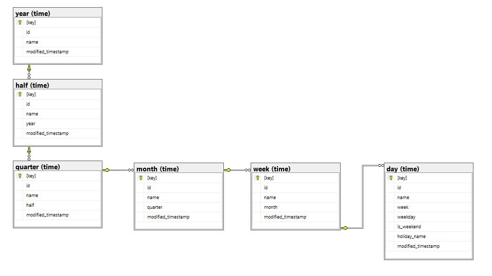

# time_database

## Introduction

Time database represents the time dimension: Year, Half, Quarter, Month, Week and Day

Is usefull to have the time dimension already in place to and use it as base for any other projects wich needs to have some calendar based informations like holidays and weekdays.

Running `EXECEUTE [dbo].[initiaize]	@start_date = N'20190101', @number_of_years = 1, @country_holida = N'ITA'` stored procedure is possible to initialize all the entities in the hierarchy according to the parameters: with the current implementation only 'ITA' and 'USA' holiday are available.

## Software and Libraries

This project uses TSQL and was developed using 
* [Microsoft Visual Studio Community](https://visualstudio.microsoft.com/vs/community/) 2019 16.3.5
* [Microsoft SQL Server Management Studio](https://docs.microsoft.com/en-us/sql/ssms/download-sql-server-management-studio-ssms?view=sql-server-ver15) 14.0.17289.0 
